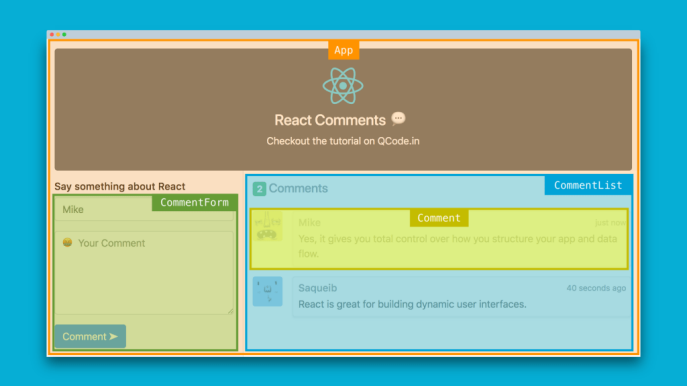

# Component trong ReactJS

## Component là gì?
Một giao diện lớn, phức tạp được chia thành nhiều thành phần UI nhỏ hơn (component) để dễ quản lý và tái sử dụng.


## Phân loại component
1. Chia theo cú pháp: Functional và Class component

    **CLASS COMPONENT**

    ```javaScript
    import React, { PureComponent } from 'react';

    class App extends PureComponent {
      render() {
        return <div>ReactJS is sexy! :P</div>;
      }
    }

    export default App;
    ```

    **FUNCTIONAL COMPONENT (recommended)**
    ```javaScript
    import React from 'react';

    function App(props) {
      return <div>ReactJS is easy to learn :P</div>;
    }

    export default App;
    ```

2. Chia theo chức năng: Container vs Presentational component

    |Container component|Presentational component|
    |---|---|
    |stateful|stateless|
    |quan tâm dữ liệu gì quan|tâm hiển thị như thế nào|
    |không biết hiển thị gì|không biết dữ liệu từ đâu ra|
    |truyền dữ liệu xuống presentational component|nhận dữ liệu từ container|

Tìm hiểu về component trong ReactJ: https://reactjs.org/docs/react-component.html